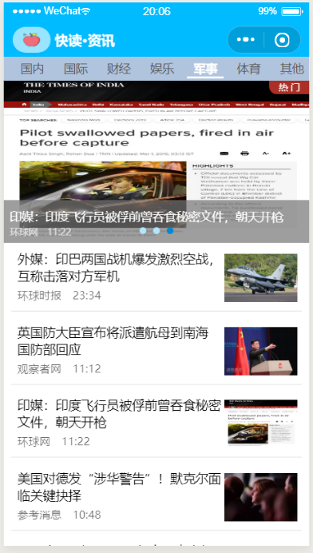

# wx-news: 极简的微信新闻小程序

## 概述

微信小程序入门项目，使用了Udacity的虚拟[新闻API](https://github.com/udacity/wmpnd-news/blob/master/news_api.md)

## 界面截图

## 已实现：
- [x] 新闻列表、分类图文显示、详情页等基础功能。
- [x] 使用 wx:for 动态的显示新闻分类部分，且导航栏浮动。
- [x] 特定页面下拉手势激活刷新功能。

## 待实现：
- [ ] 使用真实新闻API
- [ ] 下拉刷新效果优化，真机测试

## 参考：
- https://github.com/georgefeng/wx-news
- https://github.com/NearZXH/wmp-news
- https://github.com/gu-xiaohui/mini-components

## 图标下载链接
- Icons in the "images" folder made by 
- <a href="https://www.flaticon.com/authors/flat-icons" title="Flat Icons">Flat Icons</a> from <a href="https://www.flaticon.com/"     title="Flaticon">www.flaticon.com</a>
- <a href = "https://www.flaticon.com/authors/gregor-cresnar" title = "Gregor Cresnar" > Gregor Cresnar</a > from <a href = "https://www.flaticon.com/"   title = "Flaticon" > www.flaticon.com</a>
